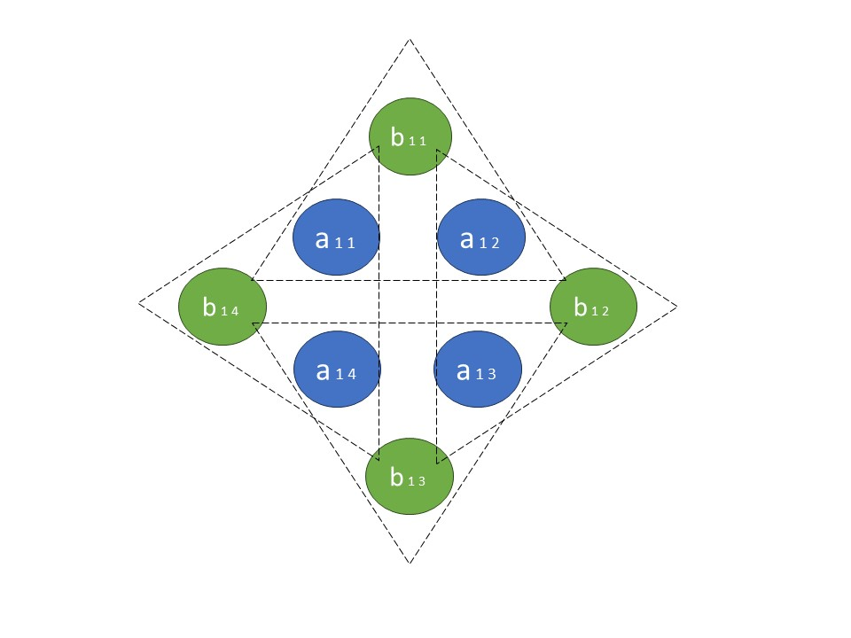
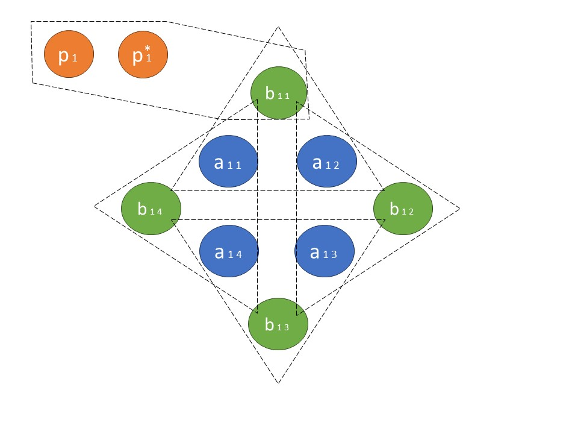
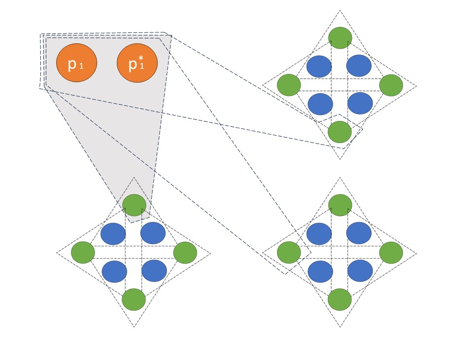
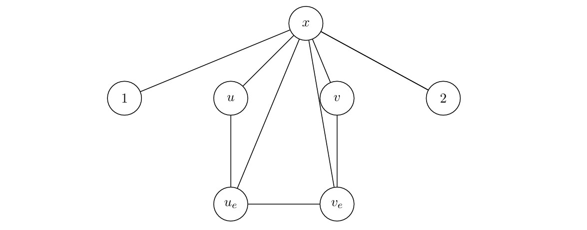

# Demostración de problemas NP-Completos

## Índice de problemas

1. 3D Matching
2. Conjunto dominante
3. Máximo Corte
4. Set cover
5. Retroalimentración de vértices (FVS)
6. Número Domatic

## 1. 3D Matching

### Definición del problema

El problema se basa en encontrar un emparejamiento dentro de un conjunto tridimensional.

Supongamos que tienes tres conjuntos disjuntos: $X$, $Y$, y $Z$, cada uno de tamaño $n$. También tienes un conjunto $T$ de ternas de la forma $(x,y,z)$, donde $x \in X$, $y \in Y$, y $z \in Z$.

El objetivo es determinar si existe un subconjunto de $T$ de tamaño $n$ (es decir, $n$ ternas) tal que cada elemento de $X$, $Y$, y $Z$ aparezca exactamente una vez en las ternas seleccionadas.

### Solución

#### `3D Matching es NP`

Dado:
- $X,Y,Z$ conjuntos de n elementos
- $T =(x,y,z)$ conjunto de triplas
- $C \subseteq T$
 
Se puede verificar en tiempo polinomial que $|C| = n$ y que todo elemento de $X,Y$ y $Z$ se encuentra una y solo una vez en algún $C_i$.

Entonces podemos afirmar que $3DM \in NP$.

#### `3D Matching es NP-Hard`

Demostraremos que **3DM** es *NP-Hard* a partir de una reducción del problema $3SAT$.

Sea una instancia del problema **3SAT** con $n$ variables ${ x_1, x_2,...,x_n}$ y $k$ clausulas ${C_1,...,C_k}$. Por cada variable $x_i$ crearemos un gadget formado por los siguientes conjuntos:

- $A_i = {a_{i1}, a_{i2}, ... , a_{i2k} }$ (núcleo del gadget)
- $B_i = {b_{i1}, b_{i2}, ... , b_{i2k} }$ (puntas del gadget)
- $T_{i} =$ conjunto de triplas de la forma ${(a_{ij},a_{ij+1}, b_{ij})}$, por ejemplo: ${(a_{i1},a_{i2}, b_{i1}), \ldots}$

(Para $k$ elementos sería una estrella con $k$ puntas)

Definimos *par* una tripla si el subíndice $j$ del elemento $b$ asociado a esta es *par*, de lo contrario diremos que es *impar*

Además nótese que para poder seleccionar todos los elementos del conjunto $A_i$ una vez se deben seleccionar todas las triplas $b_{ij}$ cuyo $j$ tenga la misma paridad, de lo contrario se repetirían elementos de $A_i$. La paridad de $j$ nos dará el valor de la variable $x_i$, si $j$ es par $\implies x_i=0$

Por cada clausula $C_j$ crearemos el set de elementos $\{p_j,p^*_j\}$ y por cada variable $i$ en la clausula $C_j$ crearemos una tripla de la siguiente forma:

- Si contiene la variable $x_i$ negada creamos la tripla $(p_j, p^*_j, b_{i2j-1})$
- Si contiene la variable $x_i$ creamos la tripla $(p_j, p^*_{j}, b_{i2j})$

Notemos que si una clausula $l$ tiene una variable $p$ sin negar y esa variable está en **true** es porque se seleccionaron las triplas de la forma $(a_{pj},a_{pj+1}, b_{pj})$ con $j$ par, por lo que podría elegirse la tripla $(p_l, p_{l1}, b_{p2l−1})$ para activarla. 

En total hay una cantidad $2*n*k$ de puntas ($b$). Si hay una solución al problema, notemos que las triplas de las clausulas cubren $k$ puntas porque a pesar de tener 3 variables solo podemos seleccionar uno.

Además las triplas asociadas a cada variable cubren $n*k$ puntas, por lo que faltaría por cubrir $(n-1)k$, entonces para remediar esto creamos los elementos ${q_m, q_{m1}}$ con $m$ desde 1 hasta $(n-1)k$ y agregaremos un tipo de gadget que llamaremos *Cleanup Gadgets* de la forma $Q_i = (q_m, q^*_{m},b)$ y los conectaremos a todas las puntas $b$.

Por último vamos a cunstruir los conjuntos disjuntos $X,Y,Z$:

- Conjunto $X$
    - $a_{ij}$ con $j$ par de los gadget variables (serían $nk$ elementos), 
    - $p_j$ de los gadgets clausula ($k$ elementos)
    - $q_m$ de los gadgets cleanup ($(n-1)k$ elementos).
- Conjunto $Y$: 
    - $a_{ij}$ con $j$ impar
    - $p_{j1}$
    - $q_{m1}$
- Conjunto $Z$: 
    - Todas las puntas ($b$) de los gadgets variables 

Nótese que $X$,$Y$ y $Z$ tienen en total $2*n*k$ elementos. Tenemos otro conjunto ($T$) que serían todas las triplas que hemos definido hasta el momento.

De esta forma hemos construido las instancias para el problema $3DM$. cuya respuesta nos da una solución a nuestro problema de $3SAT$, bastaría fijarnos en las triplas escogidas en cada variable para saber si la variable está en **true** o **false** y la variable que activa cada clausula, pueden haber varias variables que activen la clausula pero basta con saber solo una. 

Como la construcción de estos conjuntos puede hacerse en tiempo polinomial pues solo es crear y unir elementos hemos encontrado una forma de reducir $3SAT$ a $3DM$ en tiempo polinomial y como sabemos que $3SAT$ es $NP-Hard \implies 3DM$ es $NP-Hard$.

Como $3DM$ es $NP$ y $NP-Hard$ entonces es $NP-Completo$.

$$-*-$$

## 2. Conjunto dominante

### Definición del problema

En un grafo $G=(V,E)$, un conjunto de vértices $D \subseteq V$ es un conjunto dominante si cada vértice de $V$ que no está en $D$ es adyacente a al menos un vértice en $D$.

Una partición de los vértices $V$ en $k$ conjuntos $D_1,D_2,…,D_k$​ es una partición domática si cada $D_i$​ (para $i=1,2,…,k$) es un conjunto dominante. El numero dominante es la cardinalidad del menor conjunto dominante de $G$.

Hallar el numero dominante de $G$.

### Solución

Vamos a analizar primeramente el problema **Conjunto dominante** con un $k$ determinado, o sea, comprobar si existe un conjunto dominante de $k$ vértices y demostremos que este problema es *NP-Completo*. Llamemos al problema **K-Dominating-Set**

#### `K-Dominating-Set es NP`

Sean en $<G, k>$ instancia del problema **K-Dominating-Set**:
- $M$ matriz de adyacencia de $n \times n$ del grafo $G$
- $S$ conjunto de vértices del conjunto dominante
- $A$ array binario de tamaño $n$ donde para cada vértice $v$ de $G$, si $v \in S \implies A[v] = 1$

El algoritmo es el siguiente:
- Comprobar que el conjunto dominante sea de tamaño $k$ como máximo ($O(n)$). 
- Recorrer todos los vértices del grafo que no están en $S$ y comprobar en $M$ que cada uno tenga al menos un adyacente en $S$, en tiempo $O(n^2)$

#### `K-Dominating-Set es NP-Hard`

Para probar esto utilizaremos **Vertex Cover** (el problema **Vertex Cover** es teniendo en cuenta para el cubrimiento número determinado $k$ de vértices).

Sea $G$ y $G^*$ tal que:
- $G^*$ contiene todos los vértices no aislados y todas las aristas de $G$. 
- Por cada arista $(u,v)$ en $G$, se crea un nuevo vértice $X_{uv}$ en $G^*$ y se añaden las aristas $(u, X_{uv})$ y $(v, X_{uv})$.

(Nótese que esta construcción se realiza en tiempo polinomial)

Probemos que resolver **Vertex Cover** en $G$ es equivalente a resolver **K-Dominating-Set** en $G^*$.

$(\implies)$ Sea $H$ en $G$ el conjunto de vértices de **Vertex Cover**.

Sea un vértice cualquiera $v \in G^*$, tal que $v$ no pertenece a $H$. Hay dos casos:

1. $v \in G \implies$ por definición de **Vertex Cover** existe una arista entre $u$ y un cierto vértice $w$ de $H$ en $G$, por tanto existe una arista entre $v$ y $w$ en $G^*$.
2. $v \not \in G \implies$ $v$ es uno de los $X_{uv} \in G^*$ y por tanto es adyacente a dos vértices $u$ y $w$ de $G$ tal que $(u,w)$ es arista de $G$, entonces por definición de **Vertex Cover** $u$ o $w$ o ambos perteneces a $H$, entonces existe arista entre $v$ y un vértice de $H$ en $G^*$.

De 1 y 2 por definición de **K-Dominating-Set** $H$ es un **K-Dominating** de $G^*$, con cardinalidad de $H$ menor o igual que $K$.

Ahora lo demostraremos en el otro sentido:

$(\impliedby)$ Sea $H^*$ en $G^*$ el conjunto de vértices de **K-Dominating-Set**, $x \in H^*$ y $x \not \in G \implies x$ es del tipo $X_{uv}$ con $(u,v)$ arista de $G$, entonces:

1. Si $u \in H^*$ o $v \in H^*$, considerando $H^{*′} = H^* - X_{uv}$, se cumple que $H^{*′}$ sigue siendo un **K-Dominating-Set** para $G^*$, con $|H^{*′}| = H^* - 1 \le k$.
2. Si $u \not \in D$ y $v \not \in D$, considerando $H^{*′} = H^* - X_{Uv} + u$ que sigue siendo un $K-Dominating$ para $G^*$, con $|H^{*′}| = |H^*| \le k$.

Dada una arista $(u,v)$ que pertenece a $G$ se cumple que $u$ o $v$ o ambos pertenecen al **K-Dominating-Set** $H^{*′}$ de $G^*$, pues de lo contrario el vértice $X_{uv}$ de $G^*$ no sería adyacente a ningún vértice del $K-Dominating$ $H^{*′}$ de $G^*$ y por tanto se cumple que $H^{*′}$ es un **Vertex Cover** para $G$, con $|H^{*′}| \le k$.

$$-*-$$

## Máximo Corte

Sea $G=(V,E)$ un grafo con aristas ponderadas. Un corte es una division de los vertices en dos conjuntos $T$ y $V-T$. El costo de un corte es la suma de los pesos de las aristas que van de $T$ a $V-T$. El problema trata de encontrar el corte de mayor costo de un grafo.

### Solución

#### `Máximo corte es NP-Hard`

Lo probaremos a partir de **Conjunto independiente** (dado un grafo, saber si en este hay un conjunto independiente de tamaño $k$) el cual sabemos que es NP-Completo.

Sea $G = (V, E)$ y construiremos un grafo $G’ = (V’, E’)$ de la siguiente forma:
- $V’$ tendrá todos los vértices de $V$ además un vértice $x$ conectado a todos los vértices que pertenecen a $V$. 
- Por cada arista $e = (u,v) \in E$, agregaremos dos vértices: $u_e$, $v_e$ a $V’$ y cinco aristas $(u_e, v_e)$, $(u, u_e)$, $(v, v_e)$, $(x, u_e)$, $(x, v_e)$ a $E’$, y lo llamaremos el gadget $G_e$ (correspondiente a la arista $e$).
- Como todas las aristas del grafo $G’$ tendrán peso uno $\implies$ el corte de mayor peso equivale al corte con más aristas. Denominaremos el costo de un corte $S$ como $c(S)$

Vamos a probar que $G$ contiene un conjunto independiente $I \subseteq V$ , tal que $|I| \ge k$ si y solo si $\exist \ S$ en $G’$ tal que $c(S) \ge k + 4 \times |E|$. 

($\implies$) Dado un conjunto $I$, construiremos $S$ empezando con $S = I$, entonces por cada arista $e =(u,v) \in E$, analicemos los siguientes casos:
- $u \in I$ y $v \not \in I \implies$ agregamos $v_e$ a $S$ (análogamente si $u \not \in S$ y $v \in S$). Notemos que en cualquier caso se cortan 4 de las 5 aristas del gadget $G_e$ ($(u,x)$ no pertenece al gadget).
- Si $u,v \not \in I$, entonces agregamos $u_e$ y $v_e$ a $S$ (4 de las 5 aristas de $G_e$ se cortan.
- El caso donde $u,v \in I$ no es posible porque $I$ es un conjunto independiente y $(u,v)$ es una arista.

Como por cada $w \in I$, la arista $(x, w)$ se corta también por $S \implies$ el número de aristas que atraviesan el corte $S$ es $k + 4 \times |E|$.

($\impliedby$) Sea el corte de mayor costo $S$ en $G^*$ tal que $c(S) \ge k+4 \times |E|$. Como el corte genera una partición, sea $S_1$ sin pérdida de generalidad el subconjunto en el corte que no contiene al vértice $x$.

Sea $I$ el subconjunto de $S_1$ formado por vértices de $G$. Si no es un conjunto independiente $ \implies \exist \ u,v$ tal que $e = (u,v) \in E$. Es fácil ver que $S$ corta al menos tres aristas de $G_e$, ya que al menos uno de los vértices $u_e$ o $v_e$ debe estar en el otro conjunto, de lo contrario el corte no sería máximo. En cualquier otro caso (al menos $u$ o $v$ no está en $S_1$). Por tanto, siendo $m(I)$ la cantidad de aristas entre los vértices de $I$:

$$c(S) \le |I| +3 \times m(I)+4 \times (|E|−m(I)) = |I|+4 \times |E|−m(I)$$

Como $c(S) \ge k + 4 \times |E| \implies |I| \ge k + m(I) \implies$ por cada arista entre $I$, podemos eliminar uno de los vértices para decrementar el valor de $m(I)$ en uno. Después de hacer esto al menos $m(I)$ veces,  tendremos un conjunto independiente de al menos $k$.

$$-*-$$

## Set cover

### Definición del problema

Dado un conjunto $X$ y una colección S de subconjuntos de $X$, el problema consiste en determinar si existe un subcolector $S' \subseteq S$ tal que cada elemento de $X$ aparezca exactamente una vez en los subconjuntos de $S'$.

### Solución

#### `Set Cover es NP`

Si nos dan una solución (un subcolector $S^*$), podemos verificar en tiempo polinomial si cada elemento de $X$ aparece exactamente una vez en los subconjuntos de $S^*$. Si el conteo es 1 para todos los elementos, la solución es válida.

#### `Set Cover es NP-Hard`

Construimos una instancia de nuestro problema a partir de una instancia de **3DM** de la siguiente manera:

- $X^* = X \cup Y \cup Z$, el conjunto $X^*$ es la unión de los 3 conjuntos de $3DM$.
- $S = \{{x,y,z}| (x,y,z) \in T\}$: Cada tripla en $T$ se convierte en un subconjunto en $S$.
 
Demostremos que existe un *3-matching* en la instancia de **3DM** si y solo si existe un subcolector $S^* \subseteq S$ que cubre $X^*$ exactamente una vez.

$(\implies)$ Si existe un *3-matching* $M$ subconjunto de $T$ que cubre $X,Y,Z$ exactamente una vez, entonces el subcolector $S^* = \{\{x,y,z\}| (x,y,z) \in M\}$ cubre $X^*$ exactamente una vez. Cada elemento de $X^*$, ya sea de $X,Y$ o $Z$ aparecerá exactamente en un subconjunto de $S^*$.

$(\impliedby)$ Si existe un subcolector $S^*$ subconjunto que cubre $X^*$ exactamente una vez, entonces cada elemento de $X,Y$ y $Z$ debe aparecer exactamente una vez en los subconjuntos de $S^*$. Esto implica que $S^*$ define un conjunto de triplas $M$ subconjunto de $T$ que forma un $3-Matching$, ya que cada triple en $S^*$ corresponde a un triple en $T$, y cada elemento de $X$, $Y$ y $Z$ está cubierto exactamente una vez.

Como la construcción de $X^*$ y $S$ se puede hacer en tiempo polinomial en el tamaño de la instancia de $3DM \implies$ nuestro problema es $NP-Hard$.

$$-*-$$

## Retroalimentración de vértices (FVS)

### Definición del problema

Dado un grafo $G=(V,E)$, un conjunto de retroalimentación de vértices es un subconjunto de vértices $F \subseteq V$ tal que al eliminar todos los vértices en $F$ (y sus aristas incidentes), el grafo resultante no contiene ciclos (es un grafo acíclico o un bosque, si es no dirigido).

El objetivo del problema es encontrar el conjunto de retroalimentación de vértices de tamaño mínimo.

### Solución

Vamos a probar que encontrar un conjunto de retroalimentación de vértices de tamaño $k$ es *NP-Completo*, llamemos el problema **k-FVS**. Reduciremos **Vertex Cover** a este.

#### `k-FVS es NP`

Es fácil ver que se puede comprobar en tiempo polinomial que el grafo restante de eliminar los vértices seleccionados es acíclico.

#### `k-FVS es NP-Hard`

Sea $G=<V,E>$ el grafo en el que aplicaremos **Vertex Cover** y $G^*=<V^*,E^*>$ con $V^*=V$ y por cada arista $(u,v) \in E$ en $G$ se cumple que $(u,v) \in E^*$ y $(v,u) \in E^*$.

Nótese que por cada arista en $G$ tenemos un ciclo en $G^*$. Sea $F$ el conjunto de vértices a extraer del grafo $G^*$ por **k-FVS**, entonces se cumple que si $(u,v) \in E \implies v \in F$ o $u \in F$, ya que en $G^*$ existe el ciclo $\{u,v\}$. Por tanto, $F$ se convierte en un cubrimiento de vértices de $G$, con lo cual estaría resuelto el problema.

Como es *NP* y *NP-Hard* $\implies$ es *NP-Completo*.
